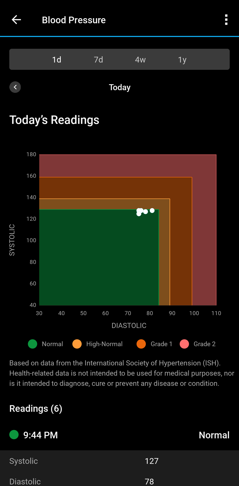
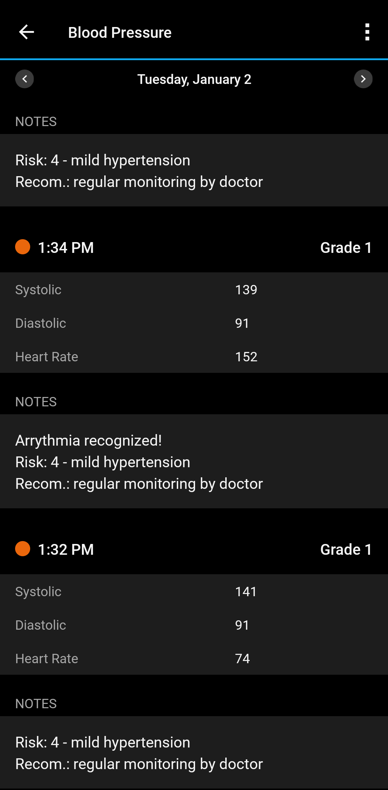

<picture>
  <source media="(prefers-color-scheme: dark)" srcset="resources/bmconnect_banner_dark.png">
  
</picture>

[](https://github.com/beep-projects/bmconnect/blob/main/LICENSE) [](https://github.com/beep-projects/bmconnect/actions/workflows/pylint.yml) [](https://github.com/beep-projects/bmconnect/issues) [](https://github.com/beep-projects/bmconnect/network) [](https://github.com/beep-projects/bmconnect/stargazers)  [](https://github.com/beep-projects/bmconnect/) [](https://github.com/beep-projects/bmconnect/) [](https://github.com/beep-projects/bmconnect/) [](https://github.com/beep-projects/bmconnect/) [](https://github.com/beep-projects/bmconnect/)

  <sup>\[[Usage](#usage)\] \[[Installation](#installation)\] \[[Contribute](#contribute)\] \[[Report bugs](https://github.com/beep-projects/bmconnect/issues)\] \[[Feedback](https://github.com/beep-projects/bmconnect/discussions)\]</sup>  

# bmconnect
`bmconnect.py` is a python script to upload measurements from a [Beurer BM58](https://www.beurer.com/uk/p/65516/#overview--anchor) blood pressure meter to a [Garmin Connect](https://connect.garmin.com) account. Each measurement is annotated with risk grading  and recommendation for action, to support you in understanding the data.  

   

If you want to get support for other devices, read the [Contribute](#Contribute) section.  
Currently I only own a Beurer BM58, wich connects under Linux as HID device `ID 0c45:7406 Microdia USB Device`.
There exist other versions of this device, which use the USB-Serial Controller `pl2303` and connect as ttyUSB device. Support for that version is copied from other projects and not tested. Please give it a try if you own such a device and send feedback.

## Usage

Before uploading data to Garmin Connect, you need configure `bmconnect.py` using the `--login` and maybe `--language` and `--default_user` options. These options are saved in the config file and reloaded, everytime the script is run.  
The config file is saved for each user running the script. If you change the user, you have to redo the configuration.  
When the script is running, it tries for 10 seconds to find a compatible device. Once a device is found, the --login credentials are used to upload the measurements. The USB version of the Beurer BM behaves wired and only can be connected for a short duration. So if you want to do second reading, or waited for to long to start the script, you have to unplug it and plug it in again. It works best, if you start the script and then immediately plugin the device.  
To avoid duplicates in your Garmin Connect account, the measurements from the last 90 days are downloaded and compared with the measurements stored on the Beurer device. Only the ones not yet available in Garmin Connect are then uploaded.  
I.e. measuremenats older than 90 days will not be uploaded and if you delete a measurement online, it might get uploaded again by the script, if it is still present on your device. 
```bash
python3 bmconnect.py -h

usage: bmconnect.py [-h] [-l] [-u {1, ..., 255}] [-du {1, ..., 255}] [-i] [-lc {de,en,es,fr,it,pl,ru,tr}]

options:
  -h, --help            Shows this help message and exits bmconnect.
  -l, --login           Configures the login credentials for the Garmin Connect account and tests them. Should be used together with the --user option, otherwise the
                        credentials for the default user will be set. This option is saved.
  -u {1, ..., 255}, --user {1, ..., 255}
                        Configures the active user from the Beurer device whose measurements shall be uploaded to Garmin Connect. Defaults to --default_user if not
                        set.
  -du {1, ..., 255}, --default_user {1, ..., 255}
                        Configure the default user from the Beurer device whose measurements shall be uploaded to Garmin Connect if --user is not given. Defaults to 1
                        if not set. This option is saved.
  -i, --ignore          Tells bmconnect to ignore the user id stored in the measurements. Needed for devices, that do not support user id in the readouts, but have
                        multiple users on the device for selection.
  -lc {de,en,es,fr,it,pl,ru,tr}, --language {de,en,es,fr,it,pl,ru,tr}
                        Configures the language used by bmconnect. Especially for measurement notes uploaded to Garmin Connect. This option is saved.
```

## Installation
At the moment, I have tested `bmconnect.py` only on an Ububtu Linux and Windows 11. On Ubuntu, I managed to run the script on USB plug in of the device, on Windows I could not figure out, how this could be achieved (USB events 400 and 410 seem not be usable as trigger in task scheduler).

### Installation on Ubuntu
<details>
<summary>Expand instructions</summary>

#### Install the script and its dependencies
```bash
git clone https://github.com/beep-projects/bmconnect/
cd bmconnect
```
Create virtual python environment and get the required modules
```bash
python3 -m venv venv
venv/bin/pip3 install -r requirements.txt
```
#### Configure bmconnect
Note, the config will be saved for the user running `bmconnect.py`, so if you intend to install bmconnect to be automatically run as soon as a device is plugged in, you have to run the following command as `sudo`.
You need to configure `--login`, but you can also configure `--user` and `--language`.
```bash
venv/bin/python3 bmconnect.py --login
```
#### Grant access to everyone
On Linux, only the root user can access the device. By adding this rule to udev, you allow access for all users. This step is not needed, if you continue to setup the automated upload on device plugin.
```bash
sudo cp 98-beurerBM58.rules /etc/udev/rules.d/
```
#### Test if everything works
Now you can test if everything works fine for you. Plug in your device and execute `bmconnect.py`. Remember, if you ran the previous configuration with `sudo`, you also have to make this call as `sudo`
```bash
venv/bin/python3 bmconnect.py
```
#### Done or continue and patch bmconnect.service 
If the test was successful, you ar done, or you can continue to install it to run everytime you plug in your Beurer device.  
For the autostart, you have to patch the provided `bmconnect.service` file, to use your current installation
```bash
# edit this line: 
# ExecStart=[path to python venv]/bin/python3 [path to script]/bmconnect.py
# by hand, or via
sed -i "s|^ExecStart=.*|ExecStart="$(pwd)"\/venv\/bin/python3 "$(pwd)"\/bmconnect.py|" bmconnect.service
```
#### Install bmconnect.service to systemd
Now you need to install the bmconnect.service for systemd. You only need to copy it, but not enable it via `systemctl`, because this service should not run on startup.
```bash
sudo cp bmconnect.service /etc/systemd/system
sudo systemctl daemon-reload
```
#### Install udev rule to call the service
Finally, you need to tell udev to start the service, whenever a Beurer device is plugged in
```bash
sudo cp 99-beurerBM58.rules /etc/udev/rules.d/
```
#### Done
udev should load the rules file automatically, so you can simply plugin your Beurer device and check if there is new data in your Garmin Connect account.

#### Debugging
debugging udev and services is tricky, so I advice you to first run the script in your python environment as described above. If everything looks good on that level, you can continue to install the .rules and .service files and watch the syslog, while you plugin your device.
```bash
tail -f /var/log/syslog
```
</details>

### Installation on Windows 11
<details>
<summary>Expand instructions</summary>

#### Install python
There are different ways to install Python on Windows. The following instructions are based on this [guide](https://learn.microsoft.com/en-us/windows/python/scripting) which installes Python from the [Microsoft App Store](https://apps.microsoft.com/search?query=python). This ensures that you have the path variable set correctly.

#### Get bmconnect code
You can install [Git](https://git-scm.com/download/win) and clone the repo or download the [zipped repo](https://github.com/beep-projects/bmconnect/archive/refs/heads/main.zip) and extract it. For the following it is assumed, that the bmconnect code is saved in *C:\git\bmconnect*

#### Install dependencies and configure libusb
Open the PowerShell and run
```powershell
cd C:\git\bmconnect\
python3 -m venv venv
.\venv\Scripts\pip3.exe install -r requirements.txt
```
#### Add libusb to $env:path
On my installation the script was complaining about a missing backend for usb.core. That was because libusb was not available in the path variable.
Adjust the following to match your installation:
```powershell
$env:path += ';C:\git\bmconnect\venv\Lib\site-packages\libusb\_platform\_windows\x64'
[Environment]::SetEnvironmentVariable("path", $env:path, "User")
```
#### Configure bmconnect
You need to configure `--login`, but you can also configure `--user` and `--language`.
```bash
C:\git\bmconnect\venv\Scripts\python.exe bmconnect.py --login
```
#### Done
You can now create a shortcut to run the script from your desktop
```Target: C:\git\bmconnect\venv\Scripts\python.exe .\bmconnect.py```
```Start in: C:\git\bmconnect\```

</details>

## Contribute
If you want to contribute to this project, please read [Contributing Guide](docs/CONTRIBUTING.md). To keep it short, it is best if you simply open a new [Discussion](https://github.com/beep-projects/bmconnect/discussions) and talk about what you want to do, or where you need help.

The language support is just added out of couriosity on how this could be done without using a big framework. So the translations are actually all done by an online translator. Feel free to improve the texts or add a new language in [bmconnect_i18n.py](bmconnect_i18n.py)

If you want to add support for another Beurer device, you can register at https://connect.beurer.com/developer/ and get access to the documentation of communication protocols. The needed code changes can be talked about in the [Discussions](https://github.com/beep-projects/bmconnect/discussions).

Projects which I used as a starting point
- https://github.com/muling-tt/beurer_bm58
- https://gitlab.com/dieheins/bpmeter
- https://github.com/curzon01/bm58
- https://github.com/cyberjunky/python-garminconnect
