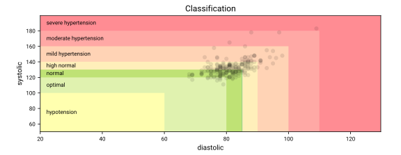
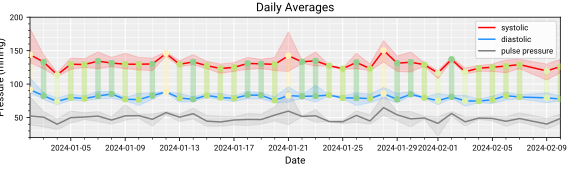
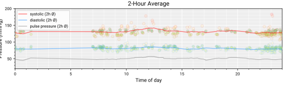
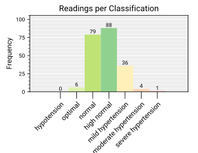
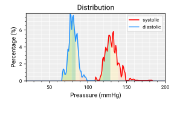

<picture>
  <source media="(prefers-color-scheme: dark)" srcset="resources/bpconnect_banner_dark.png">
  
</picture>

<sup>Code:</sup> [](https://github.com/beep-projects/bpconnect/blob/main/LICENSE) [](https://github.com/beep-projects/bpconnect/actions/workflows/pylint.yml) [](https://github.com/beep-projects/bpconnect/) [](https://github.com/beep-projects/bpconnect/) [](https://github.com/beep-projects/bpconnect/) [](https://github.com/beep-projects/bpconnect/) [](https://github.com/beep-projects/bpconnect/)  
<sup>Repo:</sup> [](https://github.com/beep-projects/bpconnect/network) [](https://github.com/beep-projects/bpconnect/stargazers) [](https://github.com/beep-projects/bpconnect/issues)   
<sup>Supported Languages:</sup><!-- base64 flags are available at https://www.phoca.cz/cssflags/ -->


<sup>\[[Usage](#usage)\] \[[Installation](#installation)\] \[[Contribute](#contribute)\] \[[Report bugs](https://github.com/beep-projects/bpconnect/issues)\] \[[Feedback](https://github.com/beep-projects/bpconnect/discussions)\]</sup>  


| # bpconnect | # bpreport |
|:--- |:--- |
|`bpconnect.py` is a python script to upload measurements from a blood pressure meter to [Garmin Connect](https://connect.garmin.com). Each uploaded measurement is annotated with risk grading  and recommendation for action, to support you in understanding the data. In your Garmin Connect account, the data will show up as Health Data - Blood Preassure. Currently only the [Beurer BM58](https://www.beurer.com/uk/p/65516/#overview--anchor) is supported, if you want to get support for other devices, you just need to volunteer for testing, or read the [Contribute](#Contribute) section and add it on your own. | With `bpreport.py` you can generate a Blood Preassure Report as PDF. The report includes some graphs and a full listing of all measuremnts used for the report. The generation of the report requires that you use `bpconnect.py` with the `--save-locally` option, to activate the creation of a local file for the measurements. |  
|<div align="center">   </div>|<div align="center">      </div>|

> [!NOTE]
> The Beurer BM58 that I own connects under Linux as HID device `ID 0c45:7406 Microdia USB Device`.
> There are other versions of this device that use the USB-serial controller `pl2303` and connect as ttyUSB device. Support for that version is copied from other projects and not tested. Please give it a try if you own such a device and send feedback.

## Usage

Typical usage of `bpconnect.py` is the synchronization of your measurement data with a Garmin Connect account, but you can also configure it, to only save the readings locally and skip the syncronization with Garmin Connect, e.g. if you only want to generate reports `bpreport.py`.  
### Usage of `bpconnect.py`
<details>
<summary>Expand instructions</summary>

Before uploading data to Garmin Connect, you need configure `bpconnect.py` using the `--login` and maybe `--language` and `--default_user` options. These options are saved in the config file and reloaded, everytime the script is run.  
The config file is saved for each user running the script. If you change the user, you have to redo the configuration.  
When the script is running, it tries for 10 seconds to find a compatible device. Once a device is found, the --login credentials are used to upload the measurements.  
To avoid duplicates in your Garmin Connect account, the measurements from the last 90 days are downloaded and compared with the measurements stored on your blood pressure meter. Only the ones not yet available in Garmin Connect are then uploaded.  
I.e. measurements older than 90 days will not be uploaded; if you delete a measurement online, it might get uploaded again by the script, if it is still present on your device.  
The USB version of the Beurer BM behaves weird and only can be connected for a short duration. If you want to do a second reading, or waited for too long to start the script, you have to unplug it and plug it in again. It works best, if you start the script and then immediately plugin the device.  

```bash
python3 bpconnect.py -h

usage: bpconnect.py [-h] [-l] [-off] [-u {1, ..., 255}] [-du {1, ..., 255}] [-i] [-lc {de,en,es,fr,it,pl,ru,tr}] [-sl] [-dsl]

options:
  -h, --help            Shows this help message and exits bpconnect.
  -l, --login           Configures the login credentials for the Garmin Connect account and tests them. Should be used together with the --user option, otherwise the
                        credentials for the default user will be set. This option is saved.
  -off, --offline       Deactivates synchronization with a Garmin Connect account. Useful if you only want to use bpreport.py. This option is not saved.
  -u {1, ..., 255}, --user {1, ..., 255}
                        Configures the active user from the Beurer device whose measurements shall be uploaded to Garmin Connect. Defaults to --default_user if not
                        set.
  -du {1, ..., 255}, --default_user {1, ..., 255}
                        Configure the default user from the Beurer device whose measurements shall be uploaded to Garmin Connect if --user is not given. Defaults to 1
                        if not set. This option is saved.
  -i, --ignore          Tells bpconnect to ignore the user id stored in the measurements. Needed for devices, that do not support user id in the readouts, but have
                        multiple users on the device for selection.
  -lc {de,en,es,fr,it,pl,ru,tr}, --language {de,en,es,fr,it,pl,ru,tr}
                        Configures the language used by bpconnect. Especially for measurement notes uploaded to Garmin Connect. This option is saved.
  -sl, --save-locally   Saves the read data locally so that it can be further processed with other tools. This option is saved.
  -dsl, --dont-save-locally
                        Ends the local saving of the read data if it was previously activated with --save_locally. This option is saved
```
</details>

### Usage of `bpreport.py`
<details>
<summary>Expand instructions</summary>

Before you can use `bpreport.py`, you need to configure `bpconnect.py` with the `--save-locally` option, in order to generate the `measurements.feather` file, used by `bpreport.py` for report generation. The script itself reads the measurement file and creates a PDF, containing some graphical representation of the measured values and a table with all measurements used for the graphics. You can use the `--start_date` and `--end_date` option, to select a subrange of your locally saved data. The created PDF file is stored in the `report` subdirectory of your installation folder.
```bash
python3 bpreport.py -h

usage: bpreport.py [-h] [-n NAME] [-b BIRTHDAY] [-sd START_DATE] [-ed END_DATE] [-g GENDER] [-lc {de,en,es,fr,it,pl,ru,tr}]

options:
  -h, --help            show this help message and exit
  -n NAME, --name NAME  The name to be used in the generated report. Is output as entered.
  -b BIRTHDAY, --birthday BIRTHDAY
                        The date to be used as the date of birth in the generated report. The date must be specified in any valid ISO 8601 format (e.g. 2021-06-11,
                        20210611, 2021-W23-5), except ordinal numbers (e.g. 2021-162)
  -sd START_DATE, --start_date START_DATE
                        Start date of the reporting period which is used in conjunction with --end_date to specify the actual period the report is generated for. The
                        date must be specified in any valid ISO 8601 format (e.g. 2021-06-11, 20210611, 2021-W23-5), except ordinal numbers (e.g. 2021-162)
  -ed END_DATE, --end_date END_DATE
                        End date of the reporting period which is used in conjunction with --start_date to specify the actual period the report is generated for. The
                        date must be specified in any valid ISO 8601 format (e.g. 2021-06-11, 20210611, 2021-W23-5), except ordinal numbers (e.g. 2021-162)
  -g GENDER, --gender GENDER
                        The gender to be used in the created report. Free text, choose what you feel like.
  -lc {de,en,es,fr,it,pl,ru,tr}, --language {de,en,es,fr,it,pl,ru,tr}
                        Configures the language used by bpconnect/bpreport. This option is saved.
```
</details>

## Installation
At the moment, I have tested `bpconnect.py` only on Ububtu 23.10 and Windows 11. On Ubuntu (and most likely any distribution using udev), the script can be triggered by the USB plug in of the device. On Windows I could not figure out, how this could be achieved (USB events 400 and 410 seem not be usable as trigger events in task scheduler).

### Installation on Ubuntu
<details>
<summary>Expand instructions</summary>

#### Install the script and its dependencies
```bash
git clone https://github.com/beep-projects/bpconnect/
cd bpconnect
```
Create virtual python environment and get the required modules
```bash
python3 -m venv venv
./venv/bin/pip3 install -r requirements.txt
```
If you want to also use `bpreport.py` run
```powershell
./venv/bin/pip3 install -r requirements_report.txt
```
#### Configure bpconnect
Note, the config will be saved for the user running `bpconnect.py`, so if you intend to install bpconnect to be automatically run as soon as a device is plugged in, you have to run the following command as `sudo`.
You need to configure `--login`, but you can also configure `--user` and `--language`.
```bash
./venv/bin/python3 bpconnect.py --login
```
#### Grant access to everyone
On Linux, only the root user can access the device. By adding this rule to udev, you allow access for all users. This step is not needed, if you only want to setup the automated upload on device plugin.
```bash
sudo cp 98-beurerBM58.rules /etc/udev/rules.d/
```
#### Test if everything works
Now you can test if everything works fine for you. Plug in your device and execute `bpconnect.py`. Remember, if you ran the previous configuration with `sudo` or if you did not grant access to everyone, you have to make this call as `sudo` 
```bash
./venv/bin/python3 bpconnect.py
```
#### Done! Or continue and patch bpconnect.service 
If the test was successful, you are done, or you can continue to install it to run everytime you plug in the USB device.  
For the autostart, you have to patch the provided `bpconnect.service` file, to use your current installation location. If you want to use options like `--ignore` you have to add it to the command in the service file as well.
```bash
# edit this line: 
# ExecStart=[path to python venv]/bin/python3 [path to script]/bpconnect.py
# by hand, or via
sed -i "s|^ExecStart=.*|ExecStart="$(pwd)"\/venv\/bin/python3 "$(pwd)"\/bpconnect.py|" bpconnect.service
```
#### Install bpconnect.service for systemd
Now you need to install the `bpconnect.service` for systemd. You only need to copy it, but not enable it via `systemctl`, because this service should not run on startup.
```bash
sudo cp bpconnect.service /etc/systemd/system
sudo systemctl daemon-reload
```
#### Install udev rule to call the service
Finally, you need to tell udev to start the service, whenever a Beurer device is plugged in
```bash
sudo cp 99-beurerBM58.rules /etc/udev/rules.d/
```
#### Done
udev should load the rules file automatically, so you can simply plugin your Beurer device and check if there is new data in your Garmin Connect account.

#### Debugging
debugging udev and services is tricky, so I advice you to first run the script in your python environment as described above. If everything looks good on that level, you can continue to install the .rules and .service files and watch the syslog, while you plugin your device.
```bash
tail -f /var/log/syslog
```
</details>

### Installation on Windows 11
<details>
<summary>Expand instructions</summary>

#### Install Python
There are different ways to install Python on Windows. The following instructions are based on this [guide](https://learn.microsoft.com/en-us/windows/python/scripting) which installs Python from the [Microsoft App Store](https://apps.microsoft.com/search?query=python). This ensures that you have the path variable set correctly.

#### Get bpconnect code
You can install [Git](https://git-scm.com/download/win) and clone the repo or download the [zipped repo](https://github.com/beep-projects/bpconnect/archive/refs/heads/main.zip) and extract it. For the following it is assumed, that the bpconnect code is saved in **C:\git\bpconnect**. If you saved the files in a different location, you have to change the instructions accordingly.

#### Install dependencies
Open the PowerShell and run
```powershell
cd C:\git\bpconnect\
python3 -m venv venv
.\venv\Scripts\pip3.exe install -r requirements.txt
```
If you want to also use `bpreport.py` run
```powershell
.\venv\Scripts\pip3.exe install -r requirements_report.txt
```
#### Add libusb to $env:path
On my installation the script was complaining about a missing backend for usb.core. That was because libusb was not available in the path variable.
Adjust the following to match your installation:
```powershell
$env:path += ';C:\git\bpconnect\venv\Lib\site-packages\libusb\_platform\_windows\x64'
[Environment]::SetEnvironmentVariable("path", $env:path, "User")
```
#### Configure bpconnect
You need to configure `--login`, but you can also configure `--user` and `--language`.
```bash
C:\git\bpconnect\venv\Scripts\python.exe bpconnect.py --login
```
#### Done
You can now create a shortcut to run the script from your desktop
```Target: C:\git\bpconnect\venv\Scripts\python.exe .\bpconnect.py```
```Start in: C:\git\bpconnect\```

</details>

## Contribute
If you want to contribute to this project, please read the [Contributing Guide](docs/CONTRIBUTING.md). To keep it short, it is best if you simply open a new [Discussion](https://github.com/beep-projects/bpconnect/discussions) and talk about what you want to do, or where you need help.

The language support is just added out of couriosity on how this could be done without using a big framework. So the translations are actually all done by an online translator. Feel free to improve the texts or add a new language in [bpconnect_i18n.py](bpconnect_i18n.py)

If you want to add support for another Beurer device, you can register at https://connect.beurer.com/developer/ and get access to the documentation of communication protocols. The needed code changes can be talked about in the [Discussions](https://github.com/beep-projects/bpconnect/discussions).

Projects which I used as a starting point
- https://github.com/muling-tt/beurer_bm58
- https://gitlab.com/dieheins/bpmeter
- https://github.com/curzon01/bm58
- https://github.com/cyberjunky/python-garminconnect
